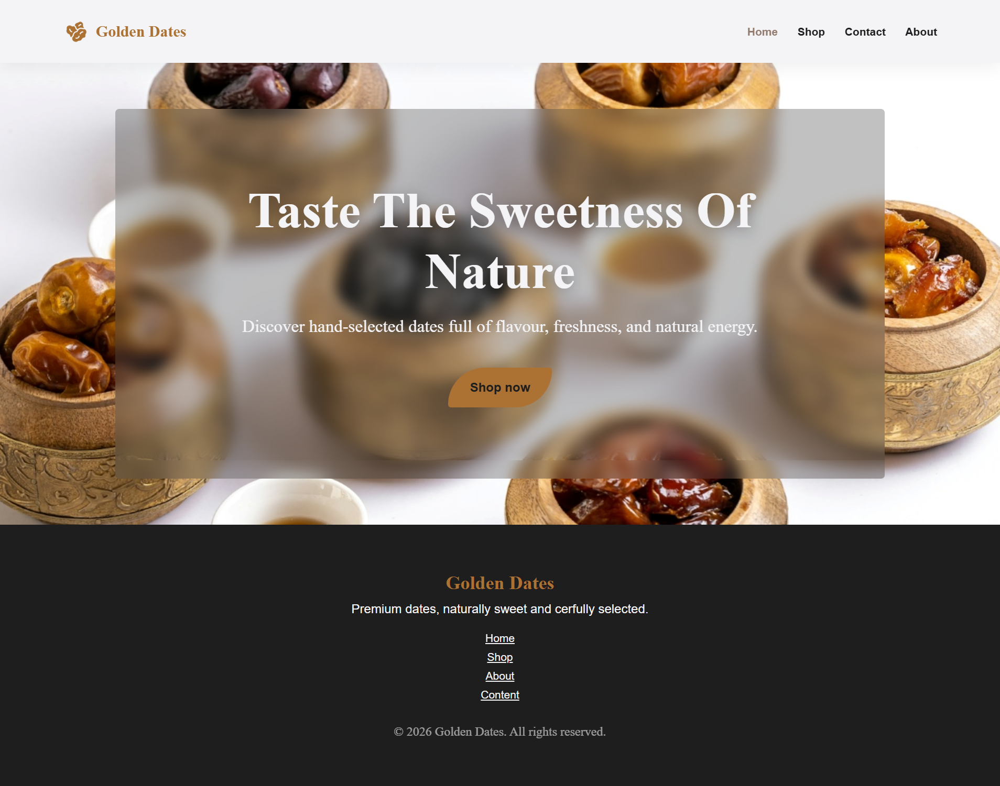

# Golden Dates - Premium Landing Page
A modern and elegant landing page for a fictional premium dates brand.  
This project was built using **pure HTML and CSS** to practice layout structure, clean UI design, and semantic markup.



## Features
- Fixed navigation bar
- Hero section with blurred overlay
- Responsive layout structure
- Clean and structured CSS
- Simple shop page layout
- Footer with navigation and branding

## Built With
- HTML5
- CSS3
- Custom font (**Montserrat**)
- Flexbox for layout alignment
- Backdrop filter for blur effects

## Project Structure

GoldenDates/    
│   
├── index.html  
├── shop.html   
├── style.css   
├── img/    
└── fonts/

## Installation

1. Clone the repository:
```bash
git clone https://github.com/aminatre/golden-dates.git
```
2. Navigate into the project folder:
```bash
cd golden-dates
```
3. Open index.html in a browser or start a local server (e.g., Live Server in VSCode)

No additional setup required.

## What I Learned

- Structuring multi-page websites
- Creating fixed navigation bars
- Using Flexbox for layout alignment
- Implementing blurred glassmorphism effects
- Writing cleaner and more maintainable CSS
- Improving semantic HTML structure

## Future Improvements

- Implement responsive mobile navigation
- Build reusable product card components
- Add subtle animations and hover interactions

## Product Status
Currently in development – layout completed, shop section in progress.